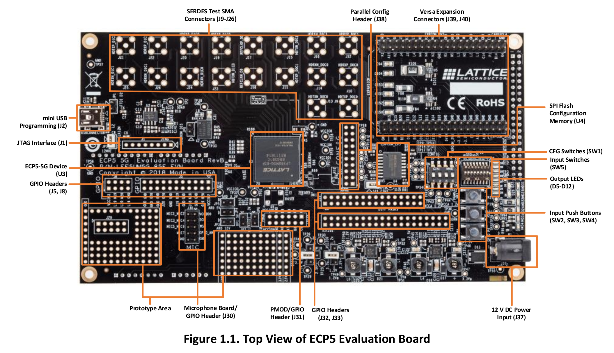
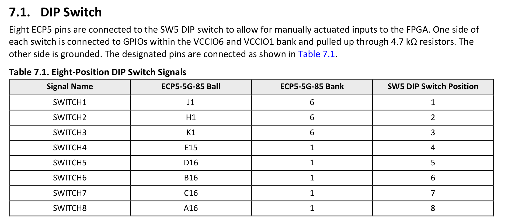

# HARDENS

*Copyright (C) Galois 2021-2022*

*Principal Investigator: Joe Kiniry <kiniry@galois.com>*

*Project Lead: Andrew Bivin <abivin@galois.com>*

*Research Engineers: Alexander Bakst <abakst@galois.com> and Michal Podhradsky <mpodhradsky@galois.com>*

Repository for the HARDENS project for the 
[Nuclear Regulatory Commission](https://www.nrc.gov/about-nrc.html).

```
This work is supported by the U.S. Nuclear Regulatory Commission (NRC), 
Office of Nuclear Regulatory Research, under contract/order number 31310021C0014.

All material is considered in development and not a finalized product. 

Any opinions, findings, conclusions or recommendations expressed in
this material are those of the author(s) and do not necessarily
reflect the views of the NRC.
```

## Overview

The goal of HARDENS is to provide to the NRC expert technical services
in order to (1) develop a better understanding of how Model-Based
Systems Engineering (MBSE) methods and tools can support regulatory
reviews of adequate design and design assurance, and (2) identify any
barriers or gaps associated with MBSE in a regulatory review of
Digital Instrumentation and Control Systems for existing Nuclear Power
Plants (NPPs).

In the HARDENS project Galois will demonstrate to the Nuclear
Regulatory Commission (NRC) cutting- edge capabilities in the
model-based design, validation, and verification of safety-critical,
mission-critical, high-assurance systems. Our demonstrator includes
high-assurance software and hardware, includes open source RISC-V
Central Processing Units (CPUs), and lays the groundwork for a
high-assurance reusable product for safety critical Digital
Instrumentation and Control Systems systems in NPPs.

Details about the HARDENS project are found in our 
[original proposal](docs/HARDENS.pdf), which was written in response 
to the [original NRC RFP](docs/RFP.pdf).

This document summarizes the current state of affairs of the project
and demonstrator.

## Task 1: Implementation

As described in our proposal and the project Statement of Work, in
Task 1 (Implementation), the first task of the HARDENS project, Galois
will implement the system described above using both (1) highly
integrated computer-based engineering development processes and (2)
model-based systems engineering.  All the modules of the simple
protection system will be modeled functionally, and one FPGA-based
circuit card will be modeled/designed in detail. The deliverable will
be the model-based design itself. We will use Galois’s RDE process and
methodology to achieve this goal, as well as the V&V in Task 2.

All project models---the SysMLv2 model, the executable, rigorously
validated and formally verified Cryptol model, and the semi-formal and
formal requirements model---are included in this release and are found
in the `develop` branch of the repository.

Also, the initial implementation of the system which runs as an
application on a POSIX host (e.g., a Linux or macOS development
machine or in the HARDENS Docker image) is found in the
as-of-yet-unmerged `c-impl` branch in the HARDENS repository.  That
implementation includes both hand-written C code conforming to the
model-based specifications discussed above, as well as automatically
synthesized formally verified sub-components, as described in the
HARDENS proposal, for a small handful of critical sub-components.
These synthesized components are generated in formally verified C
source code and in the System Verilog HDL. The POSIX-based simulation 
can execute both the generated C components and the generated System Verilog
components by means of a shim library wrapping the Verilated components.

Finally, we have a formally verified RISC-V CPU, called the `nerv`
CPU, built and tested on the ECP5-5G board.  We have sketched out
an initial three core SoC design using Bluespec SystemVerilog, but
have not yet built that SoC for emulation or put it on the FGPA.  We
will accomplish such early in Task 2, and cross-compile our POSIX C
implementation to that SoC.  That ongoing work is found in the `nerv`
branch of the repository.

## Repository Structure

The repository is structured as follows:

- [specs](./specs) contains a domain model (`*.lando`, `*.lobot`), requirements
  (exported from `FRET` to `RTS_requirements.json`), and a specification of the RTS architecture
  (`*.sysml`).
- [models](./models) contains the executable Cryptol model
- [assets](./assets) and [docs](./docs) contain project and device documentation
- [saw](./saw) contains SAW-based proofs of correctness of specific model-derived
  components
- [tests](./tests) contains end-to-end tests derived from the lando test scenarios.

## Submodules

This repository does not currently use any submodules.  If/when it
does, initialize with:

```
$ git submodule init
$ git submodule update --recursive
```

## Docker

A Docker container has been built to make for easier use, evaluation,
reusability, and repeatibility of project results.  We are adding
tools to this container as necessary during project execution.

### HARDENS Container

To build and run the core HARDENS Docker image, use the `build` and
`run` commands.

```
$ docker build -t hardens:latest .
$ docker run --network host --privileged -v $PWD:/HARDENS -it hardens:latest
```

In order to run a long-lived Docker container for reuse, use a `docker
run` command like the following, ensuring that you are in the right
directory in order to bind your sandbox properly into the container.

```
$ docker run -d -it --name HARDENS --network host --privileged -v $PWD:/HARDENS hardens:latest
```

After running such a detacted container, attach to it for interactive
use by running a command like:
```
$ docker exec -it HARDENS bash -l
```

### SysMLv2 Container

To pull and use the pre-build SysMLv2 container, use the following
`pull` command to pull the container from DockerHub.  See
https://hub.docker.com/r/gorenje/sysmlv2-jupyter for details.

```
$ docker pull gorenje/sysmlv2-jupyter:latest
$ docker run -d -it --name SysMLv2 --network host -v $PWD:/HARDENS gorenje/sysmlv2-jupyter:latest
```

## Lattice ECP5 evaluation board

We are using an ECP5-5G FPGA board for the RTS demonstrator.

Details [here](https://www.latticesemi.com/products/developmentboardsandkits/ecp5evaluationboard#_C694C444BC684AD48A3ED64C227B6455). The board uses ECP5-5G FPGA ([LFE5UM5G-85F-8BG381](https://www.latticesemi.com/en/Products/FPGAandCPLD/ECP5)) which has:

- 84k LUTs
- On-board Boot Flash – 128 Mbit Serial Peripheral Interface (SPI) Flash, with Quad read featu
- 8 input DIP switches, 3 push buttons and 8 LEDs for demo purposes



### GPIO headers

Headers are: J5, J8, J32, J33 and Max I_OUT for 3V3 is 1.35A

J5 Pinout:

* 1, 2 - VCCIO2 (Sensor 1 VIN, Sensor 2 VIN)
* 3, 4 - H20, G19 (Sensor 1 I2C)
* 5, 6 - GND (Sensor 1 GND, Sensor 2 GND)
* 7, 8 - K18, J18 (Sensor 2 I2C)

### LEDs:


### Switches



### Buttons

General purpose button `SW4` is connected to `P4`

## Sensors/Actuators

* MOSFET power control kit: https://www.sparkfun.com/products/12959
* 12 V Latch solenoid: https://www.sparkfun.com/products/15324
* Pressure sensor: https://www.sparkfun.com/products/11084
