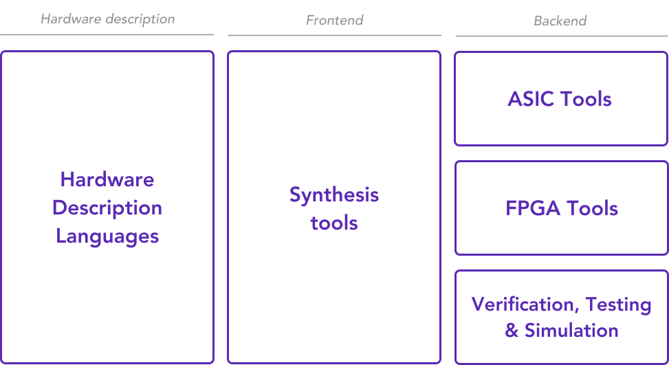
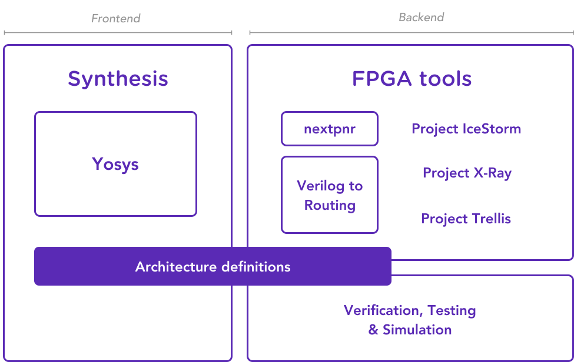

# Toolchain

Internal documentation explaining different pieces of the toolchain.

Note that [this page](https://craigjb.com/2020/01/22/ecp5/#appendix---installing-the-symbiflow-tools) was very helpful for setting up the toolchains.

## Symbiflow

- https://symbiflow.readthedocs.io/en/latest/
- https://github.com/SymbiFlow/symbiflow-arch-defs

Symbiflow claims to be an umbrella tool encapsulating all the elements of Electronic Design Automation ([EDA](https://en.wikipedia.org/wiki/Electronic_design_automation)) workflow:



Specifically we are talking about the following tools:



Interestingly, Symbiflow claims to support Lattice ECP5 board, but doesn't provide any examples so the usability of Symbiflow proper is questionable.
A brief google search also indicates that for ECP5 a combination of Yosys+Prjtrellis is used, not Symbiflow.

## Yosis

- https://github.com/YosysHQ/yosys

Yosis is a verilog synthesis tool, the way I understand it is that it reads multiple verilog files, does some optimizations and returns a single verilog file that can be then used to generate a bitstream.

## Project Trellis

- https://github.com/YosysHQ/prjtrellis

Project Trellis enables a fully open-source flow for ECP5 FPGAs using *Yosys* for Verilog synthesis and *nextpnr* for place and route. Project Trellis itself provides the device database and tools for bitstream creation.

## nextpnr

- https://github.com/YosysHQ/nextpnr

nextpnr portable FPGA place and route tool.

## ecpprog

- https://github.com/gregdavill/ecpprog

For programming the flash memory of ECP5.


## Icarus Verilog

- http://iverilog.icarus.com/

Stricter verilog parser than Yosys, used by the *icicle* project for validation.


## Other tools

### Migen, Litex

- https://github.com/m-labs/migen
- https://github.com/litex-hub


High level tools for designing hardware. *Migen* lets you create hardware in python.

### Older prebuilt ECP5 toolchain 

- https://github.com/xobs/ecp5-toolchain

For reference only.

### icicle

- https://github.com/grahamedgecombe/icicle

32-bit RISC-V system on chip for iCE40 and ECP5 FPGAs, has instructions for a build using Symbiflow/Yosys.

```
$ git clone https://github.com/grahamedgecombe/icicle
$ cd icicle
$ make BOARD=ecp5-evn syntax
$ make BOARD=ecp5-evn
```
